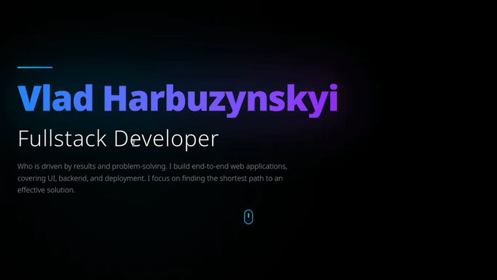

# Portfolio Website

A modern personal portfolio built with React, TypeScript, Vite, and Tailwind CSS.

This site showcases selected projects, technical skills, and contact links with a polished dark UI, animated hero section, and responsive layout.

Demo: https://



## Features

- Responsive portfolio layout for desktop and mobile
- Animated hero section with mouse-reactive gradient
- Project cards with tech tags, live preview, and GitHub links
- Skill categories with styled cards and hover effects
- Contact section with email, GitHub, and LinkedIn actions
- Built with TypeScript for better maintainability and safety

## Tech Stack

- React
- TypeScript
- Vite
- Tailwind CSS
- ESLint

## Getting Started

### Install dependencies

```bash
npm install
```

### Run development server

```bash
npm run dev
```

Open the local URL printed in the terminal to view the site.

### Build for production

```bash
npm run build
```

### Preview production build

```bash
npm run preview
```

## Customize

Update portfolio content in `src/App.tsx`:

- `projects` array for project details
- `skills` array for technical categories
- contact links in the contact section

If you want to change the theme or layout, edit the Tailwind classes in `src/App.tsx` and the global CSS in `src/index.css`.

## Project Structure

- `src/App.tsx` — main portfolio component and page content
- `src/main.tsx` — React entrypoint
- `src/index.css` — global styles
- `vite.config.ts` — Vite configuration

## Notes

This repository is configured as a private Vite app and uses Tailwind CSS for utility styling.

Feel free to replace placeholder links and contact details with real project URLs and personal links.
